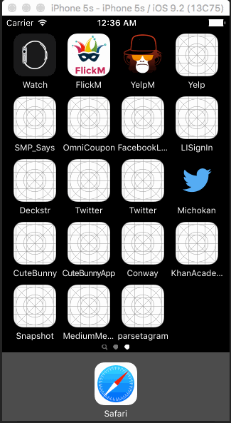

# Portfolio

**"I live, *breathe* and *sleep* swift."** - Monte Thakkar

I am really **passionate** about iOS development and I find developing new iOS apps challenging yet fun. I am looking for **opportunities** as a iOS Developer to work on **ideas** that are making (or plan to make) a **difference**

## Tools and Resources (common across all apps)-

1. Written in [Swift](https://github.com/apple/swift)
2. Use [Cocoapods](https://github.com/CocoaPods/CocoaPods)
3. Auto Layout all the way (iPhone 5/5s 6/6s 6Plus/6sPlus)
4. Git for source control via terminal
5. Use tab-bars as primary navigation


## Implemented features-

- [x] GET/POST Request (API Calls)
- [x] OAuth 
- [x] Table View/ Collection View (duh..)
- [x] Pull to referesh & Infinite Scroll
- [x] Autolayout
- [x] Map View
- [x] Camera


## Demo Apps-

  

[](https://github.com/Monte9/TwitterApp-CodePathU)

## Code Samples-

**Tab Bar setup**
```swift
func setupTabBars() {
    // Set up the Tweets View Controller
    let tweetsNavigationController = storyboard.instantiateViewControllerWithIdentifier("TweetsNavigationController") as! UINavigationController
    let tweetsViewController = tweetsNavigationController.topViewController as! TweetsViewController
    tweetsNavigationController.tabBarItem.title = "Home"
    tweetsNavigationController.tabBarItem.image = UIImage(named: "home")
    
    //Customize Tweets navigation bar UI
    tweetsNavigationController.navigationBar.titleTextAttributes = [NSForegroundColorAttributeName: UIColor(rgba: "#55acee").CGColor]
    
    // Set up the Home View Controller
    let meViewController = storyboard.instantiateViewControllerWithIdentifier("ProfileViewController")
    meViewController.tabBarItem.title = "Me"
    meViewController.tabBarItem.image = UIImage(named: "me")
    
    // Set up the Tab Bar Controller to have two tabs
    tabBarController.viewControllers = [tweetsNavigationController, meViewController]
    UITabBar.appearance().tintColor = UIColor(rgba: "#55acee")
    //    UITabBar.appearance().barTintColor = UIColor.blackColor()
    
    // Create an Image View to replace the Title View
    var imageView: UIImageView = UIImageView(frame: CGRectMake(0.0, 0.0, 40.0, 40.0))
    imageView.contentMode = UIViewContentMode.ScaleAspectFit
    var image: UIImage = UIImage(named: "Icon-Small-50")!
    imageView.image = image
    tweetsNavigationController.navigationBar.topItem?.titleView = imageView
    
    // Make the Tab Bar Controller the root view controller
    window?.rootViewController = tabBarController
    window?.makeKeyAndVisible()
    
}
```


**GET Request**
```swift
func makeSearchCallWithCompletion(completion: (gifs: [Gif]?, error: NSError?) -> ()) {
    let url = NSURL(string:"http://api.giphy.com/v1/gifs/search?q=\(searchTerm)&api_key=\(publicBetaApiKey)")
    
    let request = NSURLRequest(URL: url!)
    let session = NSURLSession(
        configuration: NSURLSessionConfiguration.defaultSessionConfiguration(),
        delegate:nil,
        delegateQueue:NSOperationQueue.mainQueue()
    )
    
    let task : NSURLSessionDataTask = session.dataTaskWithRequest(request,
        completionHandler: { (dataOrNil, response, error) in
            if let data = dataOrNil {
                if let responseDictionary = try! NSJSONSerialization.JSONObjectWithData(
                    data, options:[]) as? NSDictionary {
                        //print(responseDictionary)
                        if (responseDictionary["data"] != nil ) {
                            
                            self.gifs = Gif.gifsWithArray(responseDictionary["data"] as! [NSDictionary])
                            
                            print("Connection to API successful!")
                            completion(gifs: self.gifs, error: nil)
                        }
                        else {
                            print("error")
                            completion(gifs: nil, error: error)
                        }
                } else { completion(gifs: nil, error: error) }
            } else { completion(gifs: nil, error: error) }
    });
    task.resume()
}
```


**OAuth** (for twitter)
```swift
func openUrl(url: NSURL?) {
    
    //Get access token
    fetchAccessTokenWithPath("oauth/access_token", method: "POST", requestToken: BDBOAuth1Credential(queryString: url!.query), success: { (accessToken: BDBOAuth1Credential!) -> Void in
        print("Access Token received")
        
        TwitterClient.sharedInstance.requestSerializer.saveAccessToken(
            accessToken)
        
        TwitterClient.sharedInstance.GET("1.1/account/verify_credentials.json", parameters: nil, success: { (operation: NSURLSessionDataTask, response: AnyObject?) -> Void in
            //                print("user: \(response)")
            var user = User(dictionary: response as! NSDictionary)
            User.currentUser = user
            print("user.name = \(user.name)")
            self.loginCompletion!(user: user, error: nil)
            }, failure: { (operation: NSURLSessionDataTask?, error: NSError) -> Void in
                print("error: \(error)")
                self.loginCompletion?(user: nil, error: error)
        })
        
        })
        { (error: NSError!) -> Void in
            print("Access Token error")
            self.loginCompletion?(user: nil, error: error)
    }
    
}

func loginWithCompletion(completion: (user: User?, error: NSError?) -> ()) {
    loginCompletion = completion
    
    //remove access token if it exist previously
    TwitterClient.sharedInstance.requestSerializer.removeAccessToken()
    
    //Getting the request token and redirect to authorization page
    TwitterClient.sharedInstance.fetchRequestTokenWithPath("oauth/request_token", method: "GET", callbackURL: NSURL(string: "michokan://oauth"), scope: nil, success: { (requestToken: BDBOAuth1Credential!) -> Void in
        print("Got request token")
        var authURL = NSURL(string: "https://api.twitter.com/oauth/authorize?oauth_token=\(requestToken.token)")
        UIApplication.sharedApplication().openURL(authURL!)
        
        })
        { (error: NSError!) -> Void in
            print("Failed to get request token:  \(error)")
            self.loginCompletion?(user: nil, error: error)
    }
    //    manager.requestSerializer = [AFJSONRequestSerializer serializer];
}
```


**Map View**
```swift
//use location manager to get the current location
locationManager = CLLocationManager()
locationManager.delegate = self
locationManager.desiredAccuracy = kCLLocationAccuracyNearestTenMeters
locationManager.distanceFilter = 200
locationManager.requestWhenInUseAuthorization()

mapView.delegate = self

func locationManager(manager: CLLocationManager, didChangeAuthorizationStatus status: CLAuthorizationStatus) {
    if status == CLAuthorizationStatus.AuthorizedWhenInUse {
        locationManager.startUpdatingLocation()
    }
}

func mapView(mapView: MKMapView, viewForAnnotation annotation: MKAnnotation) -> MKAnnotationView? {
    let identifier = "customAnnotationView"
    
    // custom image annotation
    var annotationView = mapView.dequeueReusableAnnotationViewWithIdentifier(identifier)
    if (annotationView == nil) {
        annotationView = MKAnnotationView(annotation: annotation, reuseIdentifier: identifier)
    }
    else {
        annotationView!.annotation = annotation
    }
    annotationView!.image = UIImage(named: "business")
    annotationView!.canShowCallout = true
    return annotationView
}

public func mapView(mapView: MKMapView, annotationView view: MKAnnotationView, didChangeDragState newState: MKAnnotationViewDragState, fromOldState oldState: MKAnnotationViewDragState) {
    mapView.reloadInputViews()
}

func locationManager(manager: CLLocationManager, didUpdateLocations locations: [CLLocation]) {
    if let location = locations.first {
        let span = MKCoordinateSpanMake(0.1, 0.1)
        let region = MKCoordinateRegionMake(location.coordinate, span)
        region.center
        mapView.setRegion(region, animated: false)
    }
}

func addAnnotationAtCoordinate(coordinate: CLLocationCoordinate2D, title: String) {
    let annotation = MKPointAnnotation()
    annotation.coordinate = coordinate
    annotation.title = title
    mapView.addAnnotation(annotation)
    //  print("annotation added")
}

func goToLocation(location: CLLocation) {
    let span = MKCoordinateSpanMake(0.1, 0.1)
    let region = MKCoordinateRegionMake(location.coordinate, span)
    mapView.setRegion(region, animated: false)
}
```


**Search** in table views/ collection views
```swift
func searchBar(searchBar: UISearchBar, textDidChange searchText: String) {
        searchResults = searchText.isEmpty ? businesses : businesses!.filter({ (business: Business) -> Bool in
            return (business.name)!.rangeOfString(searchText, options: .CaseInsensitiveSearch) != nil
        })
        businessTableView.reloadData()
    }
```


**Gif playback** (using Gifu library)
```swift
func tableView(tableView: UITableView, didSelectRowAtIndexPath indexPath: NSIndexPath) {
        
        print("cell click detected index path \(indexPath.row)")
        
        let cell = tableView.dequeueReusableCellWithIdentifier("cell", forIndexPath: indexPath) as! GifCell
        
        var gifData = NSData(contentsOfURL: NSURL(string: gifs![indexPath.row].playingImageUrl!)!)
        
        cell.gifImageView.prepareForAnimation(imageData: gifData!)
        cell.gifImageView.startAnimatingGIF()
    }
```

## Other resources-
1.  [CodePath University](https://codepath.com/): "Without CodePath, I would still be *trying* to learn swift from a physical book"
2.  [Slack](https://slack.com/): "Helping teams everywhere 'Be less busy'"
3.  [LiceCap](http://www.cockos.com/licecap/): "Gifs created with LiceCap"
4.  [icons8](https://icons8.com/): "All the Icons You Need. Guaranteed."


## Contact
Email me @ mthakkar@mail.sfsu.edu

Follow me [@mthakkar_](https://twitter.com/MThakkar_)
